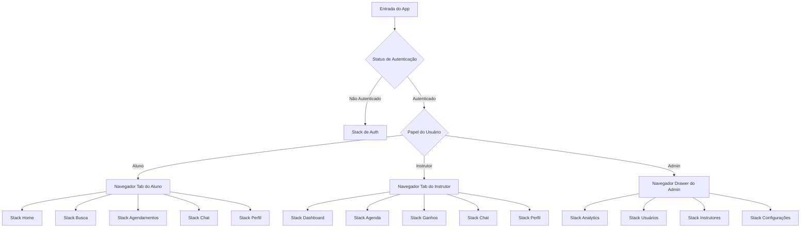

# Documento de Design: Arquitetura Frontend do Drivoo

## Visão Geral

Este documento de design delineia a arquitetura frontend completa para o Drivoo, uma aplicação React Native que conecta instrutores de autoescola com alunos em São Paulo. A arquitetura enfatiza padrões de design modernos, estruturas de navegação escaláveis e uma experiência de usuário coesa tanto para fluxos de alunos quanto de instrutores.

O design aproveita React Native 0.82.1 com TypeScript, implementando um sistema de navegação híbrido usando React Navigation v7, e estabelece um sistema de design abrangente para componentes UI consistentes. A arquitetura suporta os fluxos multi-usuário complexos necessários para o marketplace de aulas de direção, mantendo performance e sustentabilidade.

## Arquitetura

### Decisão de Arquitetura da Aplicação

**Análise: Aplicativo Único vs Aplicativos Separados:**

Após avaliar ambas as abordagens, o design recomenda uma **arquitetura de aplicativo único** com navegação baseada em papéis e acesso a recursos. Esta decisão é baseada em:

**Vantagens do Aplicativo Único:**
- Base de código compartilhada reduz overhead de desenvolvimento e manutenção
- Sistema de design consistente e experiência do usuário
- Processo simplificado de deploy e atualização
- Recursos cross-role mais fáceis (chat, notificações, componentes compartilhados)
- Presença única na app store com melhor descoberta

**Estratégia de Implementação:**
- Stacks de navegação baseados em papel (Aluno, Instrutor, Admin)
- Renderização condicional baseada em permissões do usuário
- Componentes e serviços compartilhados
- Feature flags para funcionalidade específica de papel

### Arquitetura de Navegação

O sistema de navegação implementa uma **abordagem híbrida** combinando múltiplos padrões do React Navigation v7:



**Estrutura de Navegação:**
1. **Navegador Raiz**: Renderização condicional baseada em autenticação
2. **Stack de Auth**: Fluxos de login, registro e onboarding
3. **Navegadores Baseados em Papel**: 
   - Alunos: Bottom Tab Navigator (5 abas)
   - Instrutores: Bottom Tab Navigator (5 abas)
   - Admins: Drawer Navigator (4 seções)
4. **Stacks de Recursos**: Cada aba contém um stack navigator para navegação profunda

### Arquitetura do Sistema de Design

O sistema de design segue uma **abordagem baseada em tokens** com três camadas:

**Camada 1: Tokens de Design**
- Cores, tipografia, espaçamento, sombras, bordas
- Utilitários de escala responsiva
- Adaptações específicas da plataforma

**Camada 2: Primitivos de Componentes**
- Elementos básicos de UI (Button, Input, Card, etc.)
- Componentes de layout (Container, Stack, Grid)
- Componentes de feedback (Loading, Error, Success)

**Camada 3: Componentes Compostos**
- Componentes específicos de recursos (InstructorCard, BookingCard)
- Formulários e interações complexas
- Componentes de nível de tela

## Componentes e Interfaces

### Biblioteca de Componentes Core

**Biblioteca UI Recomendada: Gluestack UI (anteriormente NativeBase)**
- Moderna, performática e ativamente mantida
- Excelente suporte ao TypeScript
- Tokens de design customizáveis
- Componentes universais (React Native + Web)
- Abordagem accessibility-first

**Opções Alternativas:**
- **Tamagui**: Para máxima performance e consistência cross-platform
- **React Native Paper**: Para aderência ao Material Design
- **Componentes Customizados**: Construídos em primitivos React Native com styled-components

### Arquitetura de Componentes

```typescript
// Estrutura de Tokens de Design
interface TokensDesign {
  cores: {
    primaria: EscalaCor;
    secundaria: EscalaCor;
    neutra: EscalaCor;
    semantica: CoresSemanticas;
  };
  tipografia: EscalaTipografia;
  espacamento: EscalaEspacamento;
  sombras: EscalaSombra;
  bordas: EscalaBorda;
}

// Padrão de Interface de Componente
interface PropsComponente {
  variante?: 'primaria' | 'secundaria' | 'outline';
  tamanho?: 'sm' | 'md' | 'lg';
  desabilitado?: boolean;
  carregando?: boolean;
  children: React.ReactNode;
}
```

### Principais Categorias de Componentes

**1. Componentes de Navegação**
- `TabBar`: Barra de abas inferior customizada com ícones específicos de papel
- `DrawerContent`: Drawer do admin com preview de analytics
- `HeaderBar`: Header consciente de contexto com ações

**2. Componentes de Formulário**
- `FormInput`: Input validado com estados de erro
- `FormSelect`: Dropdown com funcionalidade de busca
- `FormDatePicker`: Seleção de data/hora para agendamentos
- `FormImagePicker`: Upload de documentos para registro de instrutor

**3. Componentes de Exibição de Dados**
- `InstructorCard`: Perfil do instrutor com avaliações e disponibilidade
- `BookingCard`: Detalhes da aula com indicadores de status
- `ChatBubble`: Exibição de mensagem com timestamps
- `AnalyticsChart`: Visualizações do dashboard

**4. Componentes de Interação**
- `BookingButton`: Ação de agendamento consciente de contexto
- `PaymentButton`: Componente de integração com Stripe
- `FilterChips`: Interface de filtragem multi-seleção
- `MapView`: Descoberta de instrutores baseada em localização

## Modelos de Dados

### Estruturas de Dados Core

```typescript
// Gerenciamento de Usuários
interface Usuario {
  id: string;
  email: string;
  telefone: string;
  papel: 'aluno' | 'instrutor' | 'admin';
  perfil: PerfilAluno | PerfilInstrutor | PerfilAdmin;
  criadoEm: Date;
  atualizadoEm: Date;
}

interface PerfilAluno {
  primeiroNome: string;
  ultimoNome: string;
  dataNascimento: Date;
  endereco: Endereco;
  cnh: {
    categoria: 'A' | 'B' | 'AB';
    status: 'nenhuma' | 'teoria_aprovada' | 'pratica_pendente' | 'completa';
  };
  preferencias: {
    generoInstrutor?: 'masculino' | 'feminino';
    tipoVeiculo?: 'manual' | 'automatico';
    localizacao: Coordenadas;
    raio: number; // km
  };
}

interface PerfilInstrutor {
  primeiroNome: string;
  ultimoNome: string;
  detranId: string;
  licenca: {
    numero: string;
    dataVencimento: Date;
    categorias: ('A' | 'B')[];
  };
  veiculo: {
    marca: string;
    modelo: string;
    ano: number;
    transmissao: 'manual' | 'automatico';
    placa: string;
  };
  disponibilidade: AgendaSemanal;
  precos: {
    valorHora: number;
    moeda: 'BRL';
  };
  localizacao: {
    localizacaoBase: Coordenadas;
    raioAtendimento: number; // km
  };
  avaliacoes: {
    media: number;
    quantidade: number;
  };
}

// Sistema de Agendamento
interface Agendamento {
  id: string;
  alunoId: string;
  instrutorId: string;
  agendadoPara: Date;
  duracao: number; // minutos
  status: 'pendente' | 'confirmado' | 'em_andamento' | 'completo' | 'cancelado';
  localizacao: {
    enderecoColeta: Endereco;
    coordenadas: Coordenadas;
  };
  precos: {
    valorBase: number;
    taxaPlataforma: number;
    valorTotal: number;
    moeda: 'BRL';
  };
  pagamento: {
    stripePaymentIntentId: string;
    status: 'pendente' | 'sucesso' | 'falhou';
    pagoEm?: Date;
  };
  criadoEm: Date;
  atualizadoEm: Date;
}

// Comunicação
interface ConversaChat {
  id: string;
  participantes: [string, string]; // [alunoId, instrutorId]
  ultimaMensagem?: Mensagem;
  criadoEm: Date;
  atualizadoEm: Date;
}

interface Mensagem {
  id: string;
  conversaId: string;
  remetenteId: string;
  conteudo: string;
  tipo: 'texto' | 'imagem' | 'localizacao';
  metadados?: {
    urlImagem?: string;
    coordenadas?: Coordenadas;
  };
  enviadoEm: Date;
  lidoEm?: Date;
}

// Tipos de Apoio
interface Endereco {
  rua: string;
  numero: string;
  bairro: string;
  cidade: string;
  estado: string;
  cep: string;
  pais: 'BR';
}

interface Coordenadas {
  latitude: number;
  longitude: number;
}

interface AgendaSemanal {
  [key in 'segunda' | 'terca' | 'quarta' | 'quinta' | 'sexta' | 'sabado' | 'domingo']: AgendaDia;
}

interface AgendaDia {
  disponivel: boolean;
  horarios: SlotTempo[];
}

interface SlotTempo {
  horaInicio: string; // formato HH:mm
  horaFim: string;    // formato HH:mm
  disponivel: boolean;
}
```

### Estratégia de Gerenciamento de Estado

**Abordagem Recomendada: React Hook Form + Context API + AsyncStorage**

```typescript
// Estrutura de Estado Global
interface EstadoApp {
  auth: {
    usuario: Usuario | null;
    token: string | null;
    carregando: boolean;
  };
  agendamento: {
    agendamentoAtual: Partial<Agendamento> | null;
    filtrosBusca: FiltrosBusca;
    instrutoresDisponiveis: PerfilInstrutor[];
  };
  chat: {
    conversas: ConversaChat[];
    conversaAtiva: string | null;
  };
  ui: {
    tema: 'claro' | 'escuro';
    notificacoes: Notificacao[];
  };
}
```

Now I need to use the prework tool to analyze the acceptance criteria before writing the Correctness Properties section:

<function_calls>
<invoke name="prework">
<parameter name="featureName">drivoo-frontend-architecture

## Propriedades de Correção

*Uma propriedade é uma característica ou comportamento que deve ser verdadeiro em todas as execuções válidas de um sistema—essencialmente, uma declaração formal sobre o que o sistema deve fazer. As propriedades servem como ponte entre especificações legíveis por humanos e garantias de correção verificáveis por máquina.*

Baseado na análise de prework e reflexão de propriedades, as seguintes propriedades validam a funcionalidade core da arquitetura frontend do Drivoo:

### Propriedade 1: Consistência de Navegação Baseada em Papel
*Para qualquer* usuário autenticado com um papel específico (aluno, instrutor, admin), o sistema de navegação deve exibir exatamente as opções de navegação apropriadas para esse papel e nenhuma outra.
**Valida: Requisitos 1.2**

### Propriedade 2: Precisão de Navegação por Deep Link  
*Para qualquer* URL de deep link válida, o sistema de navegação deve navegar para a tela correta e manter o estado de navegação adequado.
**Valida: Requisitos 1.3**

### Propriedade 3: Preservação de Estado de Navegação
*Para qualquer* ação de navegação dentro do app, o sistema de navegação deve preservar o estado relevante e fornecer comportamento correto de navegação de volta.
**Valida: Requisitos 1.4, 1.5**

### Propriedade 4: Consistência de Tokens de Design
*Para qualquer* componente UI no sistema de design, toda estilização deve usar tokens de design ao invés de valores hardcoded, garantindo consistência visual.
**Valida: Requisitos 2.2**

### Propriedade 5: Adaptação de Design Responsivo
*Para qualquer* mudança de tamanho de tela ou orientação, componentes UI devem adaptar seu layout apropriadamente mantendo usabilidade.
**Valida: Requisitos 2.3**

### Propriedade 6: Consistência de Interface de Componentes
*Para qualquer* componente UI similar (botões, inputs, cards), eles devem compartilhar padrões de estilização consistentes e interfaces de props.
**Valida: Requisitos 2.4**

### Propriedade 7: Coleta de Dados de Registro Específica por Papel
*Para qualquer* registro de usuário com um papel específico, o sistema deve coletar exatamente os campos obrigatórios para esse papel e validá-los apropriadamente.
**Valida: Requisitos 3.2**

### Propriedade 8: Gerenciamento Seguro de Sessão
*Para qualquer* token de autenticação, ele deve ser armazenado com segurança e o estado da sessão deve ser gerenciado adequadamente através de reinicializações do app.
**Valida: Requisitos 3.3**

### Propriedade 9: Precisão de Filtragem de Instrutores
*Para qualquer* combinação de filtros de busca (data, hora, localização, gênero, tipo de veículo), o sistema de agendamento deve retornar apenas instrutores que correspondam a todos os critérios especificados.
**Valida: Requisitos 4.1**

### Propriedade 10: Completude de Informações do Instrutor
*Para qualquer* seleção de instrutor, a tela de detalhes deve exibir todas as informações obrigatórias incluindo avaliações, preços, disponibilidade e credenciais.
**Valida: Requisitos 4.2**

### Propriedade 11: Integridade de Dados de Confirmação de Agendamento
*Para qualquer* confirmação de agendamento, a tela de confirmação deve conter todos os detalhes da aula e corresponder aos parâmetros originalmente selecionados.
**Valida: Requisitos 4.3**

### Propriedade 12: Fluxo de Integração de Pagamento
*Para qualquer* reserva confirmada, o sistema de pagamento deve ser adequadamente acionado e integrado com o fluxo de agendamento.
**Valida: Requisitos 4.4**

### Propriedade 13: Sincronização de Disponibilidade
*Para qualquer* agendamento bem-sucedido, a disponibilidade do instrutor deve ser atualizada em tempo real para refletir o horário agendado.
**Valida: Requisitos 4.5**

### Propriedade 14: Distribuição de Split Payment
*Para qualquer* pagamento processado, as taxas devem ser corretamente divididas entre a plataforma e o instrutor de acordo com a porcentagem definida.
**Valida: Requisitos 5.2**

### Propriedade 15: Completude de Confirmação de Pagamento
*Para qualquer* pagamento bem-sucedido, a confirmação deve incluir todos os detalhes da transação e informações de recibo.
**Valida: Requisitos 5.3**

### Propriedade 16: Tratamento de Erro de Pagamento
*Para qualquer* falha de pagamento, o sistema deve exibir mensagens de erro apropriadas e manter o estado do agendamento para retry.
**Valida: Requisitos 5.4**

### Propriedade 17: Entrega de Mensagem em Tempo Real
*Para qualquer* mensagem enviada entre instrutor e aluno conectados, ela deve ser entregue em tempo real ao destinatário.
**Valida: Requisitos 6.1**

### Propriedade 18: Persistência de Histórico de Chat
*Para qualquer* conversa, o histórico de mensagens deve ser preservado através de sessões do app e reinicializações do dispositivo.
**Valida: Requisitos 6.2**

### Propriedade 19: Rastreamento de Status de Mensagem
*Para qualquer* mensagem enviada, indicadores de entrega e status de leitura devem ser atualizados corretamente e exibidos ao remetente.
**Valida: Requisitos 6.3**

### Propriedade 20: Suporte a Mensagens Multimídia
*Para qualquer* tipo de mensagem (texto, imagem, localização), o sistema de chat deve tratá-la e exibi-la corretamente.
**Valida: Requisitos 6.4**

### Propriedade 21: Gerenciamento de Agenda do Instrutor
*Para qualquer* atualização de agenda do instrutor, mudanças devem ser salvas corretamente e refletidas na disponibilidade para agendamentos de alunos.
**Valida: Requisitos 7.1**

### Propriedade 22: Completude de Perfil do Instrutor
*Para qualquer* perfil de instrutor, todos os campos obrigatórios de credenciais devem estar disponíveis e adequadamente validados.
**Valida: Requisitos 7.2**

### Propriedade 23: Entrega de Notificação de Agendamento
*Para qualquer* agendamento de aluno, o instrutor designado deve receber notificações apropriadas.
**Valida: Requisitos 7.3**

### Propriedade 24: Precisão de Dados de Ganhos
*Para qualquer* instrutor, ganhos e histórico de pagamentos devem ser calculados e exibidos com precisão.
**Valida: Requisitos 7.4**

### Propriedade 25: Integridade do Sistema de Avaliação
*Para qualquer* avaliação ou review submetida, ela deve ser processada corretamente e refletida nos perfis dos instrutores.
**Valida: Requisitos 7.5**

### Propriedade 26: Consistência de Padrões de UI
*Para qualquer* interação de usuário similar através de diferentes telas, elas devem se comportar consistentemente e seguir os mesmos padrões.
**Valida: Requisitos 9.2**

### Propriedade 27: Preservação de Contexto de Navegação
*Para qualquer* transição de tela, contexto relevante deve ser mantido e pistas de navegação claras devem ser fornecidas.
**Valida: Requisitos 9.3**

### Propriedade 28: Otimização de Interação Mobile
*Para qualquer* elemento interativo, alvos de toque e layouts devem seguir melhores práticas mobile para usabilidade.
**Valida: Requisitos 9.4**

### Propriedade 29: Tratamento de Estados de Carregamento e Erro
*Para qualquer* tela ou componente, estados de carregamento e condições de erro devem ser tratados apropriadamente com feedback ao usuário.
**Valida: Requisitos 9.5**

### Propriedade 30: Conformidade com Padrões de Performance
*Para qualquer* animação ou transição, a performance deve atender aos padrões do React Native para experiência suave do usuário.
**Valida: Requisitos 10.1**

### Propriedade 31: Integridade de Gerenciamento de Estado
*Para qualquer* fluxo complexo de usuário, o estado deve ser gerenciado corretamente sem perda de dados ou inconsistências.
**Valida: Requisitos 10.2**

### Propriedade 32: Segurança de Tipos TypeScript
*Para qualquer* componente ou serviço, a compilação TypeScript deve passar sem erros de tipo, garantindo segurança de tipos.
**Valida: Requisitos 10.3**

### Propriedade 33: Conformidade com Melhores Práticas de Performance
*Para qualquer* implementação, uso de memória e tamanho do bundle devem atender aos benchmarks de melhores práticas do React Native.
**Valida: Requisitos 10.4**

### Propriedade 34: Cobertura de Error Boundary
*Para qualquer* erro de runtime, ele deve ser capturado por error boundaries e reportado apropriadamente sem crashar o app.
**Valida: Requisitos 10.5**

## Tratamento de Erros

### Estratégia de Error Boundary

**Error Boundary Global**: Captura erros JavaScript não tratados e exibe UI de fallback
**Boundaries de Nível de Tela**: Isolam erros a recursos específicos sem afetar todo o app
**Boundaries de Nível de Componente**: Protegem componentes críticos como formulários de pagamento e chat

### Categorias de Erro e Tratamento

**Erros de Rede**:
- Timeouts de conexão: Mecanismo de retry com backoff exponencial
- Erros de API: Mensagens amigáveis ao usuário com sugestões de ação
- Cenários offline: Exibição de dados em cache com indicadores de sincronização

**Erros de Autenticação**:
- Expiração de token: Refresh automático ou fluxo de re-autenticação
- Erros de permissão: Mensagens de erro apropriadas ao papel
- Problemas de conta: Informações de contato de suporte

**Erros de Pagamento**:
- Cartão recusado: Mensagens claras com opções de pagamento alternativas
- Problemas de rede: Mecanismo de retry com preservação do agendamento
- Erros do Stripe: Mapeados para mensagens amigáveis ao usuário

**Erros de Validação**:
- Validação de formulário: Feedback em tempo real com orientação clara de correção
- Erros de upload de arquivo: Requisitos de tamanho/formato com exemplos
- Integridade de dados: Degradação graciosa com funcionalidade parcial

### Relatório de Crashes e Analytics

**Implementação**: Integração React Native Flipper + Crashlytics
**Coleta de Dados**: Logs de erro, ações do usuário que levaram aos erros, informações do dispositivo
**Privacidade**: Nenhum dado pessoal em relatórios de crash, identificadores de usuário anonimizados

## Estratégia de Testes

### Abordagem Dupla de Testes

A estratégia de testes emprega tanto **testes unitários** quanto **testes baseados em propriedades** como abordagens complementares:

**Testes Unitários**: Focam em exemplos específicos, casos extremos e pontos de integração
- Fluxos de autenticação com credenciais específicas
- Processamento de pagamento com números de cartão conhecidos
- Cenários de navegação com papéis específicos de usuário
- Renderização de componentes com props específicas

**Testes de Propriedade**: Verificam propriedades universais através de todas as entradas
- Comportamento de navegação através de todos os papéis de usuário e combinações de tela
- Consistência do sistema de design através de todos os componentes e tamanhos de tela
- Integridade do fluxo de agendamento através de todas as combinações instrutor/aluno
- Processamento de pagamento através de todos os cenários de pagamento válidos

### Configuração de Testes Baseados em Propriedades

**Biblioteca**: fast-check para React Native (testes de propriedade JavaScript/TypeScript)
**Configuração**: Mínimo de 100 iterações por teste de propriedade
**Marcação**: Cada teste de propriedade referencia sua propriedade do documento de design

**Exemplos de Tags de Teste**:
```typescript
// Feature: drivoo-frontend-architecture, Property 1: Consistência de Navegação Baseada em Papel
// Feature: drivoo-frontend-architecture, Property 9: Precisão de Filtragem de Instrutores
// Feature: drivoo-frontend-architecture, Property 14: Distribuição de Split Payment
```

### Categorias de Teste

**Testes de Navegação**:
- Testes unitários: Caminhos específicos de navegação e cenários de deep link
- Testes de propriedade: Comportamento de navegação através de todos os papéis de usuário e combinações de tela

**Testes de Componentes UI**:
- Testes unitários: Renderização de componentes com props e estados específicos
- Testes de propriedade: Consistência do sistema de design através de todos os componentes

**Testes de Lógica de Negócio**:
- Testes unitários: Cenários específicos de agendamento e cálculos de pagamento
- Testes de propriedade: Integridade do fluxo de agendamento e precisão da distribuição de pagamento

**Testes de Integração**:
- Testes unitários: Integração de API com respostas mock
- Testes de propriedade: Consistência de fluxo end-to-end através de diferentes combinações de dados

### Testes de Performance

**Métricas a Monitorar**:
- Tempo de inicialização do app (< 3 segundos)
- Animações de transição de tela (60 FPS)
- Uso de memória (< 150MB baseline)
- Tamanho do bundle (< 50MB total)

**Ferramentas de Teste**:
- React Native Performance Monitor
- Flipper Performance Plugin
- Bundle analyzer para otimização de tamanho
- Memory profiler para detecção de vazamentos